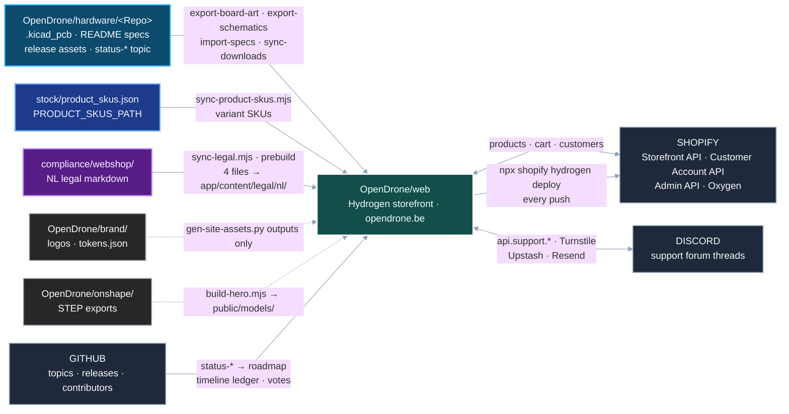
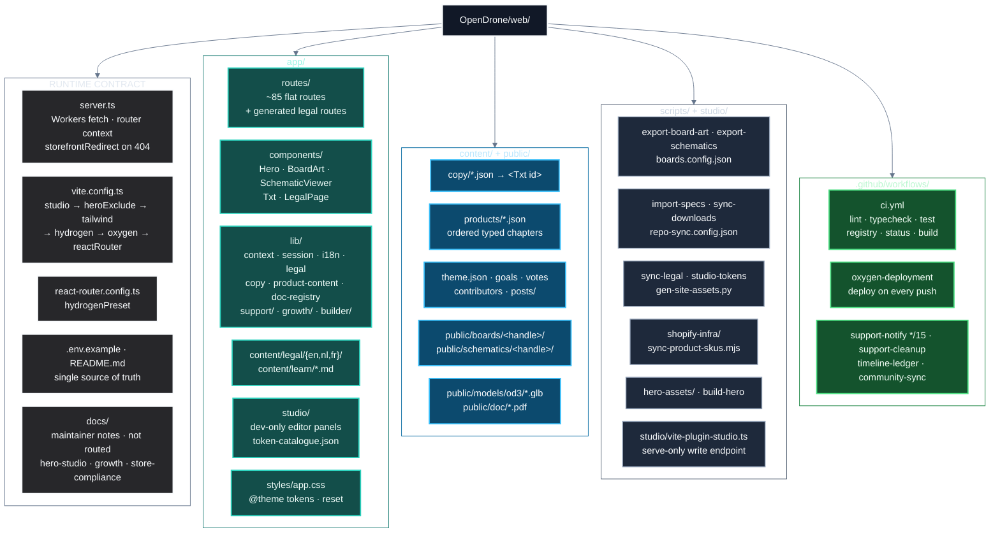
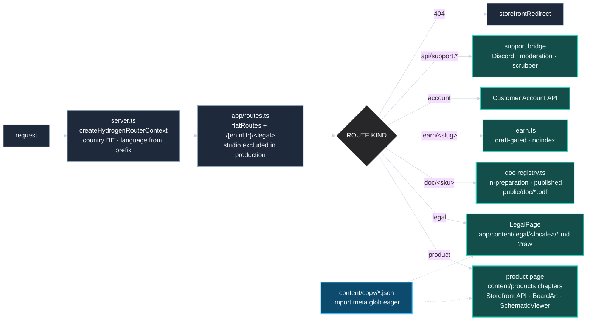
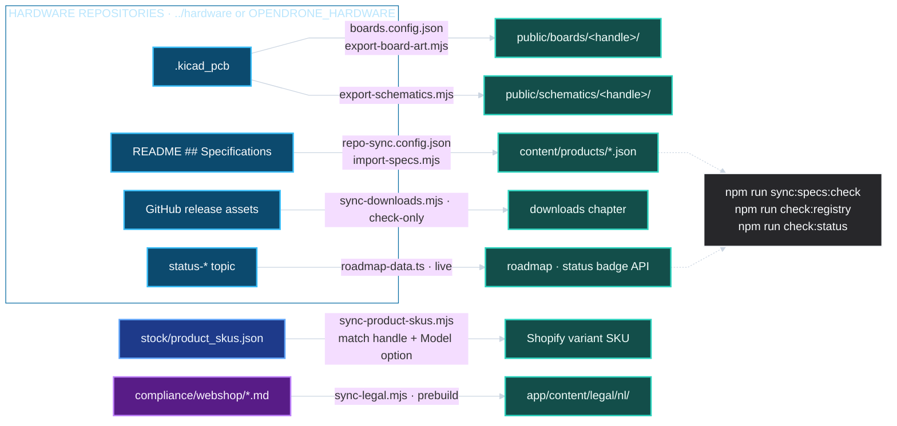

# OpenDrone storefront

## Position in the workspace

```mermaid
%%{init: {"theme": "base", "themeVariables": {"background": "#0b1120", "lineColor": "#94a3b8", "fontFamily": "Inter, ui-sans-serif, system-ui"}, "flowchart": {"curve": "linear", "nodeSpacing": 30, "rankSpacing": 44}}}%%
flowchart LR
    HW["OpenDrone/hardware/&lt;Repo&gt;<br/>.kicad_pcb · README specs<br/>release assets · status-* topic"]
    STK["stock/product_skus.json<br/>PRODUCT_SKUS_PATH"]
    CMP["compliance/webshop/<br/>NL legal markdown"]
    BR["OpenDrone/brand/<br/>logos · tokens.json"]
    ON["OpenDrone/onshape/<br/>STEP exports"]
    WEB["OpenDrone/web<br/>Hydrogen storefront · opendrone.be"]
    SHOP["SHOPIFY<br/>Storefront API · Customer Account API<br/>Admin API · Oxygen"]
    GH["GITHUB<br/>topics · releases · contributors"]
    DSC["DISCORD<br/>support forum threads"]

    HW -->|"export-board-art · export-schematics<br/>import-specs · sync-downloads"| WEB
    STK -->|"sync-product-skus.mjs<br/>variant SKUs"| WEB
    CMP -->|"sync-legal.mjs · prebuild<br/>4 files → app/content/legal/nl/"| WEB
    BR -.->|"gen-site-assets.py outputs only"| WEB
    ON -.->|"build-hero.mjs → public/models/"| WEB
    WEB <-->|"products · cart · customers"| SHOP
    WEB -->|"npx shopify hydrogen deploy<br/>every push"| SHOP
    GH -->|"status-* → roadmap<br/>timeline ledger · votes"| WEB
    WEB <-->|"api.support.* · Turnstile<br/>Upstash · Resend"| DSC

    classDef design fill:#0c4a6e,stroke:#38bdf8,color:#f8fafc,stroke-width:2px;
    classDef inventory fill:#1e3a8a,stroke:#60a5fa,color:#eff6ff,stroke-width:2px;
    classDef evidence fill:#581c87,stroke:#c084fc,color:#faf5ff,stroke-width:2px;
    classDef brand fill:#27272a,stroke:#a1a1aa,color:#fafafa,stroke-width:1.5px;
    classDef here fill:#134e4a,stroke:#f8fafc,color:#f0fdfa,stroke-width:2.5px;
    classDef external fill:#1e293b,stroke:#94a3b8,color:#f8fafc,stroke-width:1.5px;

    class HW design;
    class STK inventory;
    class CMP evidence;
    class BR,ON brand;
    class WEB here;
    class SHOP,GH,DSC external;
```

## Repository map

```mermaid
%%{init: {"theme": "base", "themeVariables": {"background": "#0b1120", "lineColor": "#64748b", "fontFamily": "Inter, ui-sans-serif, system-ui"}, "flowchart": {"curve": "basis", "nodeSpacing": 22, "rankSpacing": 34}}}%%
flowchart TB
    ROOT["OpenDrone/web/"]

    ROOT --> RT
    ROOT --> APP
    ROOT --> CONTENT
    ROOT --> PIPE
    ROOT --> CI

    subgraph RT["RUNTIME CONTRACT"]
        direction LR
        R1["server.ts<br/>Workers fetch · router context<br/>storefrontRedirect on 404"]
        R2["vite.config.ts<br/>studio → heroExclude → tailwind<br/>→ hydrogen → oxygen → reactRouter"]
        R3["react-router.config.ts<br/>hydrogenPreset"]
        R4[".env.example · README.md<br/>single source of truth"]
        R5["docs/<br/>maintainer notes · not routed<br/>hero-studio · growth · store-compliance"]
    end

    subgraph APP["app/"]
        direction LR
        A1["routes/<br/>~85 flat routes<br/>+ generated legal routes"]
        A2["components/<br/>Hero · BoardArt · SchematicViewer<br/>Txt · LegalPage"]
        A3["lib/<br/>context · session · i18n · legal<br/>copy · product-content · doc-registry<br/>support/ · growth/ · builder/"]
        A4["content/legal/{en,nl,fr}/<br/>content/learn/*.md"]
        A5["studio/<br/>dev-only editor panels<br/>token-catalogue.json"]
        A6["styles/app.css<br/>@theme tokens · reset"]
    end

    subgraph CONTENT["content/ + public/"]
        direction LR
        C1["copy/*.json → &lt;Txt id&gt;"]
        C2["products/*.json<br/>ordered typed chapters"]
        C3["theme.json · goals · votes<br/>contributors · posts/"]
        C4["public/boards/&lt;handle&gt;/<br/>public/schematics/&lt;handle&gt;/"]
        C5["public/models/od3/*.glb<br/>public/doc/*.pdf"]
    end

    subgraph PIPE["scripts/ + studio/"]
        direction LR
        P1["export-board-art · export-schematics<br/>boards.config.json"]
        P2["import-specs · sync-downloads<br/>repo-sync.config.json"]
        P3["sync-legal · studio-tokens<br/>gen-site-assets.py"]
        P4["shopify-infra/<br/>sync-product-skus.mjs"]
        P5["hero-assets/ · build-hero"]
        P6["studio/vite-plugin-studio.ts<br/>serve-only write endpoint"]
    end

    subgraph CI[".github/workflows/"]
        direction LR
        W1["ci.yml<br/>lint · typecheck · test<br/>registry · status · build"]
        W2["oxygen-deployment<br/>deploy on every push"]
        W3["support-notify */15 · support-cleanup<br/>timeline-ledger · community-sync"]
    end

    classDef root fill:#111827,stroke:#f8fafc,color:#f8fafc,stroke-width:2.5px;
    classDef rt fill:#27272a,stroke:#f8fafc,color:#f8fafc,stroke-width:2px;
    classDef app fill:#134e4a,stroke:#2dd4bf,color:#f0fdfa,stroke-width:2px;
    classDef content fill:#0c4a6e,stroke:#38bdf8,color:#f8fafc,stroke-width:2px;
    classDef pipe fill:#1e293b,stroke:#94a3b8,color:#f8fafc,stroke-width:1.5px;
    classDef ci fill:#14532d,stroke:#4ade80,color:#f0fdf4,stroke-width:2px;

    class ROOT root;
    class R1,R2,R3,R4,R5 rt;
    class A1,A2,A3,A4,A5,A6 app;
    class C1,C2,C3,C4,C5 content;
    class P1,P2,P3,P4,P5,P6 pipe;
    class W1,W2,W3 ci;

    style RT fill:transparent,stroke:#64748b,color:#e2e8f0;
    style APP fill:transparent,stroke:#0f766e,color:#99f6e4;
    style CONTENT fill:transparent,stroke:#0369a1,color:#bae6fd;
    style PIPE fill:transparent,stroke:#475569,color:#cbd5e1;
    style CI fill:transparent,stroke:#15803d,color:#bbf7d0;
```

## Request path

```mermaid
%%{init: {"theme": "base", "themeVariables": {"background": "#0b1120", "lineColor": "#cbd5e1", "fontFamily": "Inter, ui-sans-serif, system-ui"}, "flowchart": {"curve": "linear", "nodeSpacing": 26, "rankSpacing": 44}}}%%
flowchart LR
    REQ["request"] --> SRV["server.ts<br/>createHydrogenRouterContext<br/>country BE · language from prefix"]
    SRV --> RTS["app/routes.ts<br/>flatRoutes + /{en,nl,fr}/&lt;legal&gt;<br/>studio excluded in production"]
    RTS --> KIND{"ROUTE KIND"}
    KIND -->|"product"| PROD["product page<br/>content/products chapters<br/>Storefront API · BoardArt · SchematicViewer"]
    KIND -->|"legal"| LEG["LegalPage<br/>app/content/legal/&lt;locale&gt;/*.md ?raw"]
    KIND -->|"doc/&lt;sku&gt;"| DOC["doc-registry.ts<br/>in-preparation · published<br/>public/doc/*.pdf"]
    KIND -->|"learn/&lt;slug&gt;"| LRN["learn.ts<br/>draft-gated · noindex"]
    KIND -->|"account"| ACC["Customer Account API"]
    KIND -->|"api/support.*"| SUP["support bridge<br/>Discord · moderation · scrubber"]
    KIND -->|"404"| RED["storefrontRedirect"]

    COPY["content/copy/*.json<br/>import.meta.glob eager"] -.-> PROD
    COPY -.-> LEG

    classDef step fill:#1e293b,stroke:#94a3b8,color:#f8fafc,stroke-width:1.5px;
    classDef gate fill:#27272a,stroke:#f8fafc,color:#f8fafc,stroke-width:2px;
    classDef page fill:#134e4a,stroke:#2dd4bf,color:#f0fdfa,stroke-width:2px;
    classDef data fill:#0c4a6e,stroke:#38bdf8,color:#f8fafc,stroke-width:2px;

    class REQ,SRV,RTS,RED step;
    class KIND gate;
    class PROD,LEG,DOC,LRN,ACC,SUP page;
    class COPY data;
```

## Hardware to storefront sync

```mermaid
%%{init: {"theme": "base", "themeVariables": {"background": "#0b1120", "lineColor": "#cbd5e1", "fontFamily": "Inter, ui-sans-serif, system-ui"}, "flowchart": {"curve": "linear", "nodeSpacing": 26, "rankSpacing": 44}}}%%
flowchart LR
    subgraph SOURCES["HARDWARE REPOSITORIES · ../hardware or OPENDRONE_HARDWARE"]
        direction TB
        S1[".kicad_pcb"]
        S2["README ## Specifications"]
        S3["GitHub release assets"]
        S4["status-* topic"]
    end

    S1 -->|"boards.config.json<br/>export-board-art.mjs"| O1["public/boards/&lt;handle&gt;/"]
    S1 -->|"export-schematics.mjs"| O2["public/schematics/&lt;handle&gt;/"]
    S2 -->|"repo-sync.config.json<br/>import-specs.mjs"| O3["content/products/*.json"]
    S3 -->|"sync-downloads.mjs · check-only"| O4["downloads chapter"]
    S4 -->|"roadmap-data.ts · live"| O5["roadmap · status badge API"]

    SKU["stock/product_skus.json"] -->|"sync-product-skus.mjs<br/>match handle + Model option"| O6["Shopify variant SKU"]
    LEG["compliance/webshop/*.md"] -->|"sync-legal.mjs · prebuild"| O7["app/content/legal/nl/"]

    CHK["npm run sync:specs:check<br/>npm run check:registry<br/>npm run check:status"]
    O3 -.-> CHK
    O5 -.-> CHK

    classDef source fill:#0c4a6e,stroke:#38bdf8,color:#f8fafc,stroke-width:2px;
    classDef out fill:#134e4a,stroke:#2dd4bf,color:#f0fdfa,stroke-width:2px;
    classDef inv fill:#1e3a8a,stroke:#60a5fa,color:#eff6ff,stroke-width:2px;
    classDef evidence fill:#581c87,stroke:#c084fc,color:#faf5ff,stroke-width:2px;
    classDef gate fill:#27272a,stroke:#f8fafc,color:#f8fafc,stroke-width:2px;

    class S1,S2,S3,S4 source;
    class O1,O2,O3,O4,O5,O6,O7 out;
    class SKU inv;
    class LEG evidence;
    class CHK gate;

    style SOURCES fill:transparent,stroke:#0369a1,color:#bae6fd;
```

## Content editing and deploy

```mermaid
%%{init: {"theme": "base", "themeVariables": {"background": "#0b1120", "lineColor": "#94a3b8", "fontFamily": "Inter, ui-sans-serif, system-ui"}, "flowchart": {"curve": "linear", "nodeSpacing": 28, "rankSpacing": 44}}}%%
flowchart LR
    DEV["npm run dev<br/>shopify hydrogen dev --codegen"] --> STU["/studio<br/>dev-only panels"]
    STU -->|"vite-plugin-studio write endpoint"| FILES["content/copy · content/products<br/>content/theme.json · app/content/legal/**<br/>public/models/&lt;design&gt;/studio.json"]
    FILES --> DIFF["git diff = changelog"]
    DIFF --> PR["PR → ci.yml<br/>lint · typecheck · test<br/>registry · status · build"]
    PR --> MAIN["main"]
    MAIN -->|"oxygen-deployment workflow<br/>every push"| OXY["Oxygen · opendrone.be"]

    BUILD["npm run build<br/>prebuild sync:legal → hydrogen build"]
    BUILD -.-> PR

    classDef step fill:#1e293b,stroke:#94a3b8,color:#f8fafc,stroke-width:1.5px;
    classDef data fill:#0c4a6e,stroke:#38bdf8,color:#f8fafc,stroke-width:2px;
    classDef gate fill:#27272a,stroke:#f8fafc,color:#f8fafc,stroke-width:2px;
    classDef release fill:#134e4a,stroke:#2dd4bf,color:#f0fdfa,stroke-width:2px;

    class DEV,STU,BUILD step;
    class FILES,DIFF data;
    class PR gate;
    class MAIN,OXY release;
```
