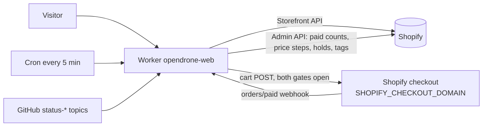
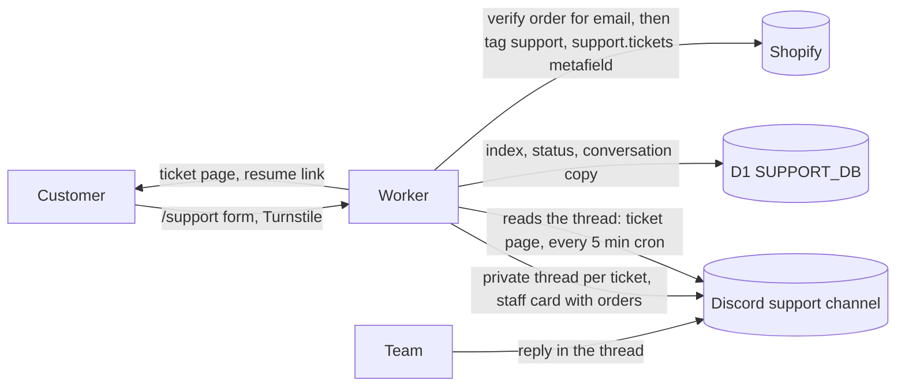
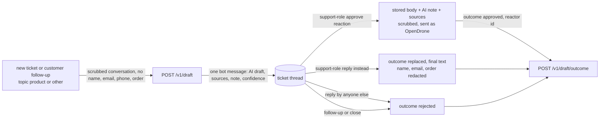
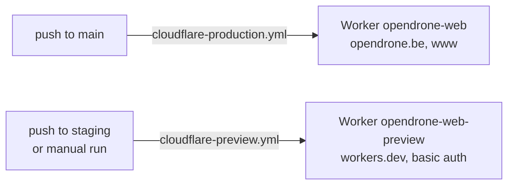

# OpenDrone Web

The storefront at [opendrone.be](https://opendrone.be): open-source FPV drone
hardware designed and sold from Belgium. Flight controllers (OpenFC), 4-in-1
ESCs (OpenESC), ExpressLRS receivers (OpenRX), carbon frames (OpenFrame) and
the OpenStack bundle.

A React Router 7 app, built with the Cloudflare Vite plugin, running as a
Cloudflare Worker. Shopify owns the catalog, prices, checkout, orders and
newsletter consent; this repository owns the pages, the preorder campaign
logic and the gates that open or close checkout. Support runs on tickets:
the customer writes on the site, the team answers in Discord. Email is for
sales only.

Selling entity: Incutec BV. OpenDrone is the community project and product
brand. This repository is MIT; the hardware repositories are CERN-OHL-S.

Deep dives in `docs/`: `product-status.md` (roadmap display and checkout gates),
`hero-studio.md` (the homepage 3D pipeline), `growth-architecture.md`
(analytics, attribution, mail), `store-compliance.md` (storefront acceptance
evidence).

## Run it locally

```sh
git clone https://github.com/OpenDrone-hw/OpenDrone-Web.git
cd OpenDrone-Web
npm install
cp .env.example .env       # SESSION_SECRET is the only required value
npm run dev                # http://localhost:3000
```

For a Shopify-backed run, set the `SHOPIFY_*` values described in
`.env.example`. Keep `PUBLIC_COMING_SOON=1` and `SHOPIFY_CHECKOUT_WRITE_ENABLED`
unset or `0` unless you are testing checkout. The app fails closed when the
catalog policy or tax configuration is missing. Node 22 (what CI uses).

## Commands

| Command | Does |
|---|---|
| `npm run dev` | dev server (server.ts in workerd) with the studio at `/studio` |
| `npm run typecheck` | `react-router typegen` then `tsc --noEmit` |
| `npm run lint` | ESLint over the repository |
| `npm test` | `node --test` over `app/**/*.test.ts`, no test framework |
| `npm run build` | the production build into `dist/` |
| `npm run preview` | build, then serve `dist/` locally with `wrangler dev` and the production Worker config |
| `npm run check:registry` | the product registry's data invariants (CI runs it; lint and tsc never evaluate them) |
| `npm run db:migrate:local` | apply `migrations/` to the local D1 the dev server uses |
| `npm run support:sandbox`, `support:staff` | fake Discord and Shopify for local ticket runs, and the team's side of them ("Test support locally") |
| `npm run check:status` | fails when a static roadmap status is ahead of its repo's `status-*` topic |
| `npm run gen:board-art` | export every PCB as layered SVG and copper rasters (needs KiCad and cwebp) |
| `npm run gen:schematics` | render the schematic sheets from the board checkouts |
| `npm run sync:specs` / `sync:specs:check` | mirror each board README's `## Specifications` table into `content/products/<handle>.json`, or diff |
| `npm run specs:placeholders` | list every spec value still marked as a placeholder |
| `npm run sync:downloads` | diff the latest GitHub release assets against the product JSON (`--check` only) |
| `npm run sync:timeline` | append releases, new repos and status flips to the timeline ledger |
| `npm run sync:contributors` | refresh `content/contributors.json` from GitHub |
| `npm run studio:coverage` | which files still have copy baked into code |
| `npm run studio:keys` | fails when code uses a copy id missing from `content/copy/` |
| `npm run audit:perf`, `audit:lh`, `audit:mobile` | performance lab, Lighthouse, mobile screenshots |
| `npm run gen:shopify-templates` | render the Shopify notification emails from `scripts/shopify-templates/` into `out/`, ready to paste into Shopify |
| `node --experimental-strip-types scripts/release-batch.mjs --sku <SKU>` | dry run: the held orders of a batch; `--apply` releases their holds (see "Fulfil a batch") |
| `node --experimental-strip-types scripts/preorder-notify.mjs --kind moved\|missed --sku <SKU> --new-date <text>` | dry run: renders the ship-date or missed-target email per order; `--send` sends through Resend (see "Tell buyers") |
| `node scripts/launch-blast.mjs <handle>` | dry run of the product mail to the `notify-<handle>` Resend segment; `--create` drafts, `--send` sends |
| `BASE=<url> node scripts/smoke.mjs` | GETs the main routes of any base URL and asserts status and content; passes with the shop open or closed (`SMOKE_AUTH=opendrone:<password>` for staging) |

The PR gate is typecheck, lint and test.

## Layout

```
app/
  root.tsx                 shell, head, Organization JSON-LD
  entry.server.tsx         CSP and security headers
  routes/                  file-based routes
  components/              shared React components
  content/legal/{en,nl,fr} legal Markdown
  lib/                     catalog, campaign, cart, i18n, SEO, product content, growth
  studio/                  the studio's editor panels
  styles/app.css           the single CSS file (Tailwind v4)
content/                   editable copy, product chapters, preorders, posts, theme tokens, goals, votes
public/                    models (GLB), board art, schematics, logos
scripts/                   board art export, hero build, sync, audit and order scripts
server.ts                  Worker entry: fetch, and the five-minute scheduled jobs
migrations/                D1 schema of the support ticket store
studio/                    the dev-only Vite plugin (the studio's write endpoint)
test/fixtures/catalog.json the catalog contract the mapper tests read
docs/                      the deep dives listed above
```

## How the site works



**Catalog.** `app/lib/shopify-storefront.ts` reads the Shopify Storefront API
into the catalog shape in `app/lib/catalog.ts`. Every Shopify SKU needs an
entry in `SHOPIFY_PREVIEW_POLICY_JSON` (`saleMode` `in_stock`, `preorder` or
`sold_out`, plus `shipPromise`); a missing entry, a non-EUR price or missing
VAT confirmation fails the catalog closed. Shopify `availableForSale` can deny
a SKU but never proves stock. Customer-account links stay hidden unless an
exact Shopify account URL is configured.

**Checkout.** Checkout is open only when `SHOPIFY_CHECKOUT_WRITE_ENABLED=1` and
`PUBLIC_COMING_SOON=0` (`checkoutOpen` in `app/lib/shopify-cart-action.ts`).
Open, `/cart` renders the session cart and `POST /api/shopify/cart` adds
lines after same-origin, SKU, availability and lifecycle checks; the checkout
URL Shopify returns must be on `SHOPIFY_STORE_DOMAIN` or
`SHOPIFY_CHECKOUT_DOMAIN`, otherwise the add fails. Closed, `/cart` redirects
to `/products` and cart POSTs are refused. `PUBLIC_COMING_SOON` other than `0`
also renders every product as coming soon, with a notify-me signup instead of
prices.

**Preorders.** `content/preorders.json` lists production batches per SKU: paid
stock with its own ship date, or a funding target whose supplier order is
placed once that many units are ordered. Only SKUs the policy sells as
`preorder` are affected.

| Piece | Where | Does |
|---|---|---|
| Paid counts | `app/lib/shopify-orders.ts` | counts paid Shopify orders per SKU since `countFrom`, cached one minute per isolate; if unreadable, campaign SKUs close |
| Batch and promise | `app/lib/preorder-campaign.ts` | derives the batch, the meter and the ship promise (with `deliveryBy` when set) |
| Cart line | `app/lib/shopify-cart-action.ts` | every preorder line carries its promise as a `Preorder` attribute, so checkout and the confirmation state it |
| Price steps | `app/lib/shopify-price-tier.ts` | `priceTiers` steps the price off the compare-at (retail) price as paid units come in; written to Shopify only when `SHOPIFY_PRICE_TIER_WRITE_ENABLED=1`; a SKU Shopify prices under its step closes |
| Holds and tags | `app/lib/preorder-fulfilment.ts` | holds each open fulfillment order (handle `opendrone-preorder`) and tags the order `preorder` and `batch:<SKU>:<N>`; a tagged order is never held again |
| Accessories | `shipsWith` in `content/preorders.json` | spares ride a campaign SKU at a flat price, pinned to a dated batch or following the lead's next unit; they do not count toward the lead |
| Health | `/api/status/campaign` | per campaign SKU: open or closed, paid counts, pending price steps, last job runs; `503` when a campaign SKU is closed |

Price steps and holds run from the `orders/paid` webhook
(`/api/shopify/orders-paid`, HMAC-verified with `SHOPIFY_WEBHOOK_SECRET`,
`503` without it) and from the Worker's five-minute `scheduled` reconcile.
`/preorder` explains the model and tracks every target. The model is an
ordinary Shopify order paid in full with custom batch logic, not Shopify's
selling-plan preorders.

**Cart country.** A new cart gets the visitor's country (`CF-IPCountry`) as
its Shopify buyer country. `POST /api/shopify/cart-country` (form field
`country`, same-origin, open only when checkout is) sets another country on
the session cart. Consumers buy direct only in an EU country marked
`saleApproved` in `content/registrations.json`
(`app/lib/shipping-rates.ts`); other EU countries show as not open, non-EU
visitors see "EU consumer orders only" with links to `/wholesale` and the
newsletter, and blocked countries get no checkout. The final address is
restricted by Shopify's markets and shipping profiles, not by this gate.

**Product lines.** OpenESC 20x20 / 30x30 and the four OpenRX variants are one
Shopify product with a `Model` attribute; the page renders a tier ladder matched
to the catalog's variants by option name and value. Product images use Shopify
CDN URLs directly.

**Status.** The `status-*` GitHub topics describe roadmap lifecycle; they never
authorize a purchase. Topics are cached; the static fallback in
`app/lib/roadmap-data.ts` must lag the topic, never lead it. While the shop is
open, `app/lib/launched-roadmap.ts` shows a board with a paid batch as at least
beta. `/roadmap`, the product pages, the feeds and the README badge endpoint
`/api/status/<Repo>.json` use these inputs. Read `docs/product-status.md`
before touching that chain.

**Product pages** are a sequence of typed chapters (teardown, schematics, open
source, specs, in the box, downloads, firmware, reviews, contributors, prose)
ordered and toggled per product in `content/products/*.json`. The teardown is a
layered SVG of the real PCB exported from KiCad; scrolling peels the copper
layers apart.

**Board art and specs come from the board repositories.** `npm run
gen:board-art` shells out to `kicad-cli` and KiCad's `pcbnew` Python to export
each PCB (`scripts/boards.config.json` maps handles to `.kicad_pcb` paths
relative to the directory holding the board checkouts, `../hardware` by default,
`OPENDRONE_HARDWARE` overrides). `npm run sync:specs` reads each mapped
README's `## Specifications` table (`scripts/repo-sync.config.json`) into the
product JSON. Rows a README does not carry go in `specsExtra` (product or
tier), accessory rows in `content/accessories.json`. Keys named in a
`placeholders` array are values awaiting the final figure, never marked on the
page; `npm run specs:placeholders` lists them.

**Homepage hero.** A three.js scene (`app/components/HeroDroneScene.tsx`) plays
the Onshape assembly, exported as one GLB and chunked by
`scripts/hero-assets/build-hero.mjs` into `public/models/<design>/`. It loads
only on desktop with `prefers-reduced-motion: no-preference`; everyone else
gets a static splash, and every beat's copy is plain DOM text. Pipeline and
tuning: `docs/hero-studio.md`.

**Timeline.** `/timeline` combines a curated list in `app/routes/timeline.tsx`
with `timeline-ledger.json` on this repository's unprotected `data` branch,
appended daily by `.github/workflows/timeline-ledger.yml` from releases, new
repos and `status-*` flips across the public OpenDrone-hw repositories.

**Support.** See "Support tickets" below.

**Trade.** `/wholesale` takes quote requests from shops in the EU27 and the
United States for the whole range, outside the Shopify cart, without creating
an order or promising import eligibility. Terms are settled in an accepted
written quote. One request carries what a quote needs: company legal name,
contact, email, phone, website (optional for a physical-only store), how the
shop sells, country, VAT number (format-checked per EU country) or EIN,
shipping address, billing address when it differs, SKU lines, and optionally a
wanted delivery date, expected monthly reorders, how the shop heard of
OpenDrone and a note. A honeypot, a per-IP limit and Turnstile guard it. An EU
VAT number is looked up in VIES (the answer goes in the email, never blocks).
The form emails `PUBLIC_COMPANY_EMAIL` through Resend (`RESEND_API_KEY`,
`SUPPORT_FROM_EMAIL`) with reply-to the shop: the details, a table of SKUs,
quantities and catalog list prices excluding VAT with a total, and the VAT
treatment. Without a key it reports the request as not sent. The shop gets no
email; the page shows what was sent. Entry points: header, mobile menu,
footer, coming-soon product pages, `/preorder`, `/products` and the non-EU
cart notes. SKUs, checks, VIES lookup, validation and email are in
`app/lib/trade.ts`.

**Reviews.** The PDP's rating line and reviews chapter read Shopify's standard
`reviews.rating` and `reviews.rating_count` product metafields, maintained by
the installed review app (Judge.me). No third-party script runs on the page. A
product without those metafields renders no trace of the feature.

**Newsletter.** Posts are Markdown in `content/posts/` (`published: true`
publishes at `/newsletter/<slug>` and in `/newsletter.rss`). The footer signup
records single-opt-in consent in Shopify and adds the `newsletter` tag plus
`notify-<handle>` for product interest, and `country-<CODE>` for a visitor from
a country sold only through shops. `/newsletter/unsubscribe` sets Shopify
consent to `UNSUBSCRIBED`. `SHOPIFY_NEWSLETTER_WRITE_ENABLED` gates consent
writes independently of checkout.

**Legal.** The legal documents in `app/content/legal/{en,nl,fr}/` serve at
`/{en,nl,fr}/<slug>`; the bare `/<slug>` redirects to the visitor's cached
locale, and `LangToggle` appears only on legal paths. This repository is the
authoring source for them. The site UI is English-only. `/recycling` adds the
producer (EPR) registration numbers per EU country from
`content/registrations.json`; a number still `null` is not shown.

**Other routes.**

| Route | Behaviour |
|---|---|
| `/products` | the one browse page; `/collections/*`, `/search`, `/cart/*` and `/discount/*` redirect to it |
| `/preorder`, `/wholesale`, `/shipping`, `/roadmap`, `/timeline` | content pages driven by the sources above |
| `/open-source`, `/production`, `/firmware-partners` | content pages |
| `/doc/<sku>` | per-SKU EU Declaration of Conformity page |
| `/learn` | draft-gated, noindex knowledge pages |
| `/contact` | redirects to `/support`; `/account/support` goes to `/support/find`, other `/account/*` to the Shopify account |
| `robots.txt`, `sitemap.xml`, `security.txt`, `healthz`, `llms.txt`, `products.json` | generated live from the catalog |
| `/blog*`, `/releases*`, `/contribute`, `/incutec` | 301 stubs |

## Support tickets

Every non-sales question goes through a ticket. The customer opens and
follows it on the site; the team answers in Discord; Shopify's customer
record is the CRM view. No Discord account is needed to open a ticket.



| Piece | Where | Does |
|---|---|---|
| Front door | `/support` (`app/routes/support.tsx`) | topic (order, product, warranty, other), the fields that topic needs, attachments, Turnstile; tickets this browser opened; find, community and sales links |
| Ticket page | `/support/t/<ref>` | status, conversation, reply with attachments, mark solved, the private link (copy, replace); refreshes every 8 s while visible |
| Way back | `/support/resume?t=<token>`, `/support/find` | an HMAC-signed link (90 days, per ticket link version); or the email plus the ticket number (that ticket), or plus an order number Shopify confirms for that email (the tickets about that order; 8 wrong order numbers per email, from any IP, stop that route until one drains every 6 hours) |
| Rules | `app/lib/support/tickets.ts` | create, relay both ways, status, find, scheduled jobs |
| Discord | `app/lib/support/discord.ts` | REST only; private thread (text channel) or post (forum channel) per ticket |
| Shopify | `app/lib/support/shopify.ts` | order ownership check, exact-email customer match, `support` tag and `support.tickets` metafield |
| Safety | `scrubber.ts`, `moderation.ts`, `uploads.ts`, `tokens.ts`, `limits.ts` | scrub both directions, customer text escaped in Discord, optional approval gate, 5 files of 8 MB (24 MB total; images, video and PDFs checked by content in the browser and the Worker, programs refused under any name), signed cookie and links, rate limits (creating and finding counted in D1 per IP, an IPv6 client by its /64, then per IP plus email) |
| Jobs | `server.ts` `scheduled`, `POST /api/support/cleanup` | sync open tickets, reply notices when enabled, close answered tickets after 30 silent days and any other after 90 idle days, delete tickets 24 months after closing |

**Identity.** The email on a ticket is a claim. An order number that
Shopify confirms for that email makes it a match, not proof: order numbers
are sequential and printed on shipping labels. On a match the ticket is
linked to the Shopify customer, the staff card says **email and order
number match (not proof of identity)**, shows the order history and earlier
tickets (those opened without a matching order marked **email not
verified**), and the customer record gets the `support` tag and the ticket
in `support.tickets`. Change an address or refund only after a reply from
the email on the Shopify order. Without a match the card says **email not
verified** and shows none of that; ask for the order number before sharing
order details.

**For the team, in the ticket thread.** The first message is the staff card:
reference, topic, first name, whether the email and order number match,
and on a match the order with its preorder batch and recent orders. Customer
messages arrive as a quote under "Name · customer", with markdown escaped
and masked links shown as their real address. The email and the Shopify
admin link go to `DISCORD_STAFF_METADATA_CHANNEL_ID` when set.

| In the thread | Effect |
|---|---|
| a message | relayed to the customer (first name only, emails, phone numbers, IBANs, cards, tokens and Discord mentions redacted); status Answered |
| `// ...` | internal note, never relayed |
| `!waiting` | status Waiting on you |
| `!answered` | status Answered |
| `!close` | Closed; a customer reply reopens it |
| `!open` | Open again |
| locking or deleting the thread | Closed and locked: the customer is told to open a new ticket |
| editing or deleting a relayed reply | the customer's page follows (in enforce mode an edited reply is withdrawn; post it again). Only the newest 100 messages of a thread are re-checked; for an older reply, post a correction |

Messages are handled in thread order, once each. With
`SUPPORT_MODERATION_MODE=enforce` a reply reaches the customer only after a
holder of `SUPPORT_MOD_ROLE_ID` reacts ✅; the bot marks a held reply ⏳,
and later messages and commands wait behind it until it is approved.
Removing the ✅ after a reply was relayed does not withdraw it: delete the
message instead. The Worker reads reactors only when a reply's ✅ count
changes, and follows Discord's rate-limit headers: a wait up to 3 s is
waited out once, a longer one ends that sync until the next pass.

**Status.** Open (the team is up), Answered, Waiting on you, Closed.

**Email.** Replies are not emailed while `SUPPORT_EMAIL_NOTIFY_ENABLED` is
not `1`; the ticket page and the private link carry the conversation.
Turned on, the cron sends one "new reply" mail per unseen reply, with a
fresh link and no message content.

**Retention.** Tickets are deleted 24 months after closing: the entry in the
customer's `support.tickets` metafield (a ticket waits while that fails),
the Discord thread, the staff-metadata post and the D1 rows. Rate counters
hold keyed hashes, never an IP or email, and go after a day (the per-email
order-number misses once drained, at most two days). `POST /api/support/cleanup` with `Authorization: Bearer
$SUPPORT_CLEANUP_SECRET` runs it by hand (`?dry=1` lists, `?jobs=1` runs
the whole cron pass).

**Retired.** `/api/support/{start,send,poll,list,lookup,status,thread,close,notify,feedback}`
answer `410`.

### ChatFPV (AI)

ChatFPV (`CHATFPV_URL`, repository incutec-org/chatfpv) answers FPV and
OpenDrone questions with sources. Three switches in `[vars]`, each off
unless `"1"`: `"1"` in `wrangler.toml` (staging), `"0"` in
`wrangler.production.toml`. `CHATFPV_KEY` is a Worker secret read on the
server only. Server calls go through the `CHATFPV` service binding to the
`chatfpv` Worker: Cloudflare refuses a Worker's fetch to another workers.dev
Worker on the same account (error 1042), so the public URL fails from here.

| Switch | Effect when `"1"` |
|---|---|
| `CHATFPV_DRAFTS_ENABLED` | AI drafts in ticket threads (also needs `CHATFPV_KEY`) |
| `CHATFPV_ASK_ENABLED` | "Ask ChatFPV (AI)" box above the `/support` form; `POST /api/support/ask` |
| `CHATFPV_WIDGET_ENABLED` | "Ask ChatFPV (AI)" button on product pages and `/preorder`, opening `CHATFPV_URL/embed` in an iframe; the ChatFPV origin is added to the CSP `frame-src` |



**Drafts in the thread.** A draft is one bot message: "AI draft by ChatFPV,
not sent to the customer", the text, its sources, ChatFPV's note and a
confidence. It reaches the customer only when a holder of
`SUPPORT_MOD_ROLE_ID` reacts with the approve emoji, whatever
`SUPPORT_MODERATION_MODE` says (`log` and `off` never send a draft; no
role configured means no draft is ever sent). The stored text is sent, not
the Discord message, with "This reply was drafted with AI (ChatFPV) and
checked by the OpenDrone team." and the source links, through the same
scrubber as every staff reply. Replying normally instead sends your own
reply and, when you hold `SUPPORT_MOD_ROLE_ID`, tells ChatFPV it was
replaced: your reply, with the customer's name, email and order references
redacted, is its correction. A reply by anyone else rejects the draft and
is never a correction. A
customer follow-up replaces a pending draft with a new one; closing the
ticket or deleting the draft message drops it. With no draft, the thread
gets at most ChatFPV's one-line note. Rows live in `support_ai_drafts`
(migration `0004`); outcomes ChatFPV did not accept are retried by the
cron, except those it refused for good (400, 404, 409). A ChatFPV timeout (20 s) or error never blocks a ticket.

**Ask box and widget.** The box answers on the page with sources and the AI
label; "Still need help? Open a ticket" opens the form with the question
filled in, and a question ChatFPV hands off (orders, refunds, warranty) or
cannot ground goes to the form directly. `/support?ticket=1` skips the box.
`POST /api/support/ask` accepts same-origin requests only, 20 an hour per
IP (an IPv6 client by its /64, per isolate), and asks ChatFPV `/v1/chat`
server side, so the browser never talks to ChatFPV and the CSP needs no
`connect-src` entry. Each call carries `X-ChatFPV-Client`, a hash of the
store key and the visitor's IP bucket, so ChatFPV limits each visitor on its
own rather than every visitor behind the storefront's one address. A
`FLAG_TURNSTILE="1"` on ChatFPV would refuse these calls: it expects a
browser Turnstile token.

### Set up support

One-time, per environment (the production config ships with a placeholder
database id that fails the deploy until it is replaced):

```sh
npx wrangler d1 create opendrone-support           # production; staging: opendrone-support-preview
# paste the printed database_id into wrangler.production.toml (wrangler.toml for staging)
npx wrangler d1 migrations apply SUPPORT_DB --remote --config wrangler.production.toml
for s in DISCORD_BOT_TOKEN DISCORD_GUILD_ID DISCORD_SUPPORT_CHANNEL_ID DISCORD_STAFF_METADATA_CHANNEL_ID \
         SUPPORT_MOD_ROLE_ID SUPPORT_MODERATION_MODE SUPPORT_SESSION_SECRET SUPPORT_CLEANUP_SECRET \
         TURNSTILE_SITE_KEY TURNSTILE_SECRET_KEY; do
  npx wrangler secret put "$s" --config wrangler.production.toml
done
```

| System | Setting |
|---|---|
| Discord bot | in the guild; on the support channel: View Channel, Send Messages (Create Posts on a forum), Send Messages in Threads, Create Private Threads, Manage Threads, Read Message History, Attach Files, Add Reactions; on the staff metadata channel: View Channel, Send Messages. No privileged intents: moderator approval reads only the member who reacted |
| Discord staff role | `SUPPORT_MOD_ROLE_ID`: View Channel, Send Messages in Threads, Read Message History and Add Reactions on the support channel; its ✅ releases a held reply |
| Discord channel | `DISCORD_SUPPORT_CHANNEL_ID` a text channel (private threads) or a forum only staff can see |
| Shopify | Admin token scopes `read_customers`, `write_customers`, `read_orders`; a customer metafield definition `support.tickets` (JSON) pins the list on the customer page |
| Staging | shares the Shopify store: leave `SUPPORT_SHOPIFY_WRITE_ENABLED` unset there and point its Discord secrets at a test channel |

New migrations in `migrations/` are applied the same way before the deploy
that needs them.

### Test support locally

A sandbox stands in for Discord and the Shopify Admin API, in memory, so a
ticket runs end to end without posting to Discord or writing to Shopify.
Each worktree gets its own local D1 (`.wrangler/`), so parallel testers pick
their own two ports.

```sh
npm run support:sandbox -- --port 5196 --dev-port 5195 --write-env          # terminal 1
VITE_CACHE_DIR=.vite-cache npm run dev -- --port 5195 --strictPort           # terminal 2
open http://localhost:5195/support                                           # jan@example.com, order #1042
SUPPORT_SANDBOX_PORT=5196 npm run support:staff -- reply OD-XXXX-XXXX "Hi"   # act as the team
```

| Step | Does |
|---|---|
| `support:sandbox` | applies `migrations/` to the local D1, writes `.env.local` (`--write-env`, else prints the lines), serves the fake APIs; `--moderation enforce` holds replies until approved |
| `.env.local` | `SUPPORT_DEV_DISCORD_API`, `SUPPORT_DEV_SHOPIFY_ADMIN_URL`, `SUPPORT_DEV_STOREFRONT_URL` (localhost only), sandbox Discord ids, a sandbox signing secret, Cloudflare's test Turnstile key with the dev-only skip. Restart the dev server after changing it; delete it when done |
| `VITE_CACHE_DIR=.vite-cache` | a private Vite cache; worktrees sharing `node_modules` otherwise share `node_modules/.vite` and serve each other stale modules |
| `support:staff -- <command> <ref> [text]` | `reply`, `note` (`//`), `waiting`, `close`, `open`, `lock`, `approve` (moderator ✅ on the last staff message), `edit [id] text`, `delete [id]` (the last or given staff message), `state` (threads, metadata posts, Shopify writes as JSON) |

The fake Shopify knows one customer, `jan@example.com`, with order `#1042`
(preorder batch 2): that email with that order is verified, anything else
is not. The fake team member is "Sam Support". `.env.local` carries a dummy
`SHOPIFY_ADMIN_API_TOKEN`, `SHOPIFY_STORE_DOMAIN=support-sandbox.invalid` and
`SUPPORT_DEV_STOREFRONT_URL` (an empty catalogue from the sandbox), so no
request reaches the real store; that dev server shows no products. Rate limits stay
on and live in the local D1: six tickets an hour and ten find attempts an
hour per IP; to reset, stop both, `rm -rf .wrangler/state`, and start them again. The overrides work on the dev server only:
`app/lib/support/dev-overrides.ts` needs Vite's `DEV` flag, which a build
folds to `false`, and `dev-overrides.test.ts` checks a built Worker holds
no trace of them.

## The studio

`npm run dev`, open `/studio`: a local mirror of the site where everything
editable is outlined. Click a string, type, save. No database, no publish
step; `git diff` is the changelog.

| Tab | Edits | Files |
|---|---|---|
| Words | page and product copy | `content/copy/*.json`, `content/products/*.json` |
| Chapters | product page sections: order, titles, on or off | `content/chapters.json` (created on first save) |
| Design | design tokens | `content/theme.json` |
| Media | browse images and where each is used | read-only, `public/` |
| Docs | legal pages in en, nl, fr; newsletter posts (new post from the template); learn articles | `app/content/legal/**`, `content/posts/*.md`, `app/content/learn/*.md` |
| Data | batches, targets, price steps, dates, builds, accessories, team, registrations, as validated JSON | `content/*.json` |
| Hero | the 3D scene: lighting, timeline, camera, materials | `public/models/<design>/studio.json` |
| Goals | goal meters and vote tallies | `content/goals.json`, `content/votes.json` |

The studio cannot reach production: the write endpoint is a Vite plugin with
`apply: 'serve'`, `app/routes.ts` excludes the route from the build, and a
build-stage plugin deletes the studio HTML from the output.

Editable copy: create `content/copy/<page>.json` with `$route` and `$title`,
render strings with `<Txt id="<page>.<key>" />` (`app/components/Txt.tsx`) or
`copyText(id)` for attributes. Inline markup is `[label](/path)`, `*emphasis*`
and `**strong**` only. Catalog data is edited in Shopify, board art comes from
KiCad and the hero model from Onshape.

## Theming and i18n

Light and dark through CSS custom properties. Every colour is a semantic token
(`--color-bg`, `--color-text`, `--color-gold`, ...); dark is the default in the
Tailwind `@theme` block, light overrides the same names under `html.light`, and
an inline head script resolves the theme before first paint. Never hardcode a
hex that changes between themes. Brand assets and the one gold literal:
`brand/README.md`. `resolveLegalLoader` in `app/lib/i18n.ts` picks the legal
Markdown by URL prefix and each legal route emits hreflang for en, nl, fr.

## Environment variables

The annotated list is [`.env.example`](.env.example). `PUBLIC_*` values reach
the client bundle; tokens and the SKU policy never do.

| Group | Variables | Set as |
|---|---|---|
| Session | `SESSION_SECRET` | Worker secret |
| Shop gates | `PUBLIC_COMING_SOON`, `SHOPIFY_CHECKOUT_WRITE_ENABLED` | `[vars]` in the wrangler config |
| Storefront | `SHOPIFY_STORE_DOMAIN`, `SHOPIFY_STOREFRONT_TOKEN`, `SHOPIFY_STOREFRONT_API_VERSION`, `SHOPIFY_CHECKOUT_DOMAIN`, `SHOPIFY_PRICES_INCLUDE_VAT`, `SHOPIFY_PREVIEW_POLICY_JSON`, `SHOPIFY_CUSTOMER_ACCOUNT_URL` | Worker secrets |
| Admin | `SHOPIFY_ADMIN_API_TOKEN`, `SHOPIFY_ADMIN_API_VERSION`, `SHOPIFY_PRICE_TIER_WRITE_ENABLED`, `SHOPIFY_WEBHOOK_SECRET` | Worker secrets |
| Mail | `SHOPIFY_NEWSLETTER_WRITE_ENABLED`, `RESEND_API_KEY`, `SUPPORT_FROM_EMAIL`, `TURNSTILE_*`, `DISCORD_SUPPORT_INVITE`, `PUBLIC_DISCORD_INVITE`, `PUBLIC_COMPANY_*` | Worker secrets or vars |
| Support tickets | `SUPPORT_DB` (D1 binding), `DISCORD_BOT_TOKEN`, `DISCORD_GUILD_ID`, `DISCORD_SUPPORT_CHANNEL_ID`, `DISCORD_STAFF_METADATA_CHANNEL_ID`, `SUPPORT_MOD_ROLE_ID`, `SUPPORT_MODERATION_MODE`, `SUPPORT_SESSION_SECRET`, `SUPPORT_CLEANUP_SECRET` | binding in the wrangler config, the rest Worker secrets |
| Support switches | `SUPPORT_SHOPIFY_WRITE_ENABLED`, `SUPPORT_EMAIL_NOTIFY_ENABLED` | `[vars]` in `wrangler.production.toml` |
| Roadmap | `GITHUB_STATUS_TOKEN` | Worker secret |
| Staging only | `STAGING_PASSWORD` | Worker secret |

## Hosting and deploy



| | Production | Staging |
|---|---|---|
| Config | `wrangler.production.toml` | `wrangler.toml` |
| Trigger | every push to `main`: a merge is a production deploy | every push to `staging`, or a manual run of the workflow |
| Hostnames | `opendrone.be`, `www.opendrone.be` (Custom Domains; `server.ts` redirects `www` to the apex) | a workers.dev URL, HTTP basic auth (user `opendrone`, `STAGING_PASSWORD`), `X-Robots-Tag: noindex, nofollow` |
| Shop | the gates in its `[vars]` | always open, against the same Shopify store; pay with Shopify's test gateway |
| Price steps and cron | yes | never writes prices |

To preview any branch on staging, push it to `staging`:
`git push --force origin HEAD:staging`. Static files from `dist/client` are
served by Cloudflare before the Worker runs, so they bypass basic auth and the
noindex header. Both workflows use the repository secrets
`CLOUDFLARE_API_TOKEN` and `CLOUDFLARE_ACCOUNT_ID` and pin wrangler 4.
`community-sync.yml` refreshes the contributor roster; `timeline-ledger.yml`
updates the public repository timeline.

## Open or close the shop

Both gates must be open for checkout; closing either one closes it.

| Setting | Where | Open | Closed |
|---|---|---|---|
| `PUBLIC_COMING_SOON` | `wrangler.production.toml` `[vars]` | `"0"` | anything else: coming-soon pages, no prices |
| `SHOPIFY_CHECKOUT_WRITE_ENABLED` | `wrangler.production.toml` `[vars]` | `"1"` | anything else: cart POSTs refused, `/cart` redirects |
| `SHOPIFY_PREVIEW_POLICY_JSON` | Worker secret | `preorder` (campaign SKUs, `shipPromise: null`) or `in_stock` per SKU for sale | `sold_out` with `shipPromise: null` |
| `SHOPIFY_CHECKOUT_DOMAIN` | Worker secret | the host of Shopify's checkout links | not needed |
| `SHOPIFY_PRICE_TIER_WRITE_ENABLED` | Worker secret | `"1"` while a campaign steps prices | anything else |
| `SHOPIFY_WEBHOOK_SECRET` | Worker secret | the signing secret of the app that registered the `orders/paid` webhook to `/api/shopify/orders-paid` | not needed |

The gates change by a PR to `wrangler.production.toml` (a merge deploys it);
secrets change with `wrangler secret put <NAME> --config
wrangler.production.toml`. A JSON `status: development` in
`content/products/<handle>.json` locks one product without closing the shop.

An open shop also depends on Shopify settings this repository cannot check:

| Shopify setting | Holds when |
|---|---|
| Payments active, automatic capture | a test order is paid, captured and refunded |
| Admin API token scopes | `read_orders`, `read_all_orders` (campaigns over 60 days), `write_orders`, `write_products`, `write_merchant_managed_fulfillment_orders` |
| Markets and shipping profiles | only approved EU addresses can check out |
| Redirect theme published | the Shopify-hosted storefront forwards to opendrone.be |
| Online Store password page off | checkout opens for customers, not only staff |

After any change: `BASE=https://opendrone.be node scripts/smoke.mjs` and
`curl https://opendrone.be/api/status/campaign`.

## Run a preorder campaign

| Source | Owns |
|---|---|
| `content/preorders.json` | `countFrom`, `endsOn`, `priceTiers`, `pendingShips`, per-SKU `batches` (`units`, `paid`, `ships`, `deliveryBy`) and `shipsWith` |
| `content/registrations.json` | producer numbers and explicit `saleApproved` per EU destination |
| Shopify | compare-at (retail) price, current price, catalog identity, orders, payments |
| `SHOPIFY_PREVIEW_POLICY_JSON` | which SKUs sell as `preorder` |
| `app/content/legal/{en,nl,fr}/` | customer terms (7bis) |

1. Edit `content/preorders.json` (by hand or the studio Data tab): set
   `countFrom` to the first day whose paid orders count, the batches with
   `units`, `paid` and `ships` for ordered stock, `deliveryBy` as the
   reviewed customer delivery date, `endsOn` and `pendingShips` for funding
   targets, and `priceTiers`. `npm test` checks that `pendingShips` names
   `endsOn` and the latest ship date.
2. In Shopify, set each campaign SKU's compare-at price to retail and its
   price to the first step. A SKU priced under its step stays closed.
3. Set the SKU to `preorder` in `SHOPIFY_PREVIEW_POLICY_JSON` with
   `shipPromise: null`, and `SHOPIFY_PRICE_TIER_WRITE_ENABLED=1`.
4. Open the shop (above) and check `/api/status/campaign`: every campaign SKU
   `open`, `allOpen: true`, no pending price step.

A reached funding target: place the supplier order, then set that batch's
`ships`; new orders fall into the next batch. `deliveryBy` is a customer
delivery date, not a supplier or carrier date; `null` leaves it out of the
promise. A producer number alone does not open a destination; `saleApproved`
does, after its evidence is reviewed. The strategy behind a campaign lives in
the team's Notion
([OpenDrone launch strategy](https://app.notion.com/p/3e6fe06764e18191a111c05fa37db3d0)),
not here.

## Fulfil a batch

Paid preorder orders stay on hold until their batch is released. Verify in
the shipping integration that held orders cannot produce a label. When a
batch arrives:

1. `node --experimental-strip-types scripts/release-batch.mjs --sku <SKU> --batch <N>`
   lists the held orders tagged `batch:<SKU>:<N>`: the ones that ship now, and
   the ones that still wait for another batch in the same order (an order
   ships as one parcel). Add `--with <SKU>:<N>` for any other batch that is
   also in stock, or settled because its item was refunded or the buyer chose
   to wait.
2. Run it again with `--apply`. It releases the preorder hold on each order
   that ships now. Nothing else changes.
3. In the bpost plugin, import the released orders and print the labels.

The script reads the Shopify Admin credentials from `.env` and never prints
them. An order with an item whose target was missed is released once that
item is refunded in Shopify admin: a line with nothing left to ship no longer
holds the order back.

## Tell buyers

Terms 7bis.3 and 7bis.3bis promise an email when a ship date moves and when a
funding target is missed. `scripts/preorder-notify.mjs` writes them per order,
in the buyer's language (English, Dutch or French):

- Ship date moved: `node --experimental-strip-types scripts/preorder-notify.mjs --kind moved --sku <SKU> --batch <N> --new-date "<date>" --new-date-nl "<datum>" --new-date-fr "<date>"`.
- Target missed by `endsOn`: `--kind missed --sku <SKU> --batch <N> --new-date "<new target date>"`.
  The email offers a refund or to wait, and states the 30-day reply deadline
  after which the item is refunded.

Without `--send` it prints every email and sends nothing. With `--send` it
sends through Resend from `SUPPORT_FROM_EMAIL` with replies to
`PUBLIC_COMPANY_EMAIL`, and tags each order `notified-<kind>:<SKU>:<N>` (a
rerun skips those orders; `--again` resends). Record each answer with
`--record "#<order>" --sku <SKU> --choice refund|wait --apply`, which tags the
order `preorder-refund:<SKU>` or `preorder-wait:<SKU>`. Refunds are made in
Shopify admin.

## Security

- Headers (`app/entry.server.tsx`): nonce-based CSP, HSTS with preload,
  `X-Frame-Options: DENY`, nosniff, strict referrer policy, restrictive
  Permissions-Policy, COOP and CORP.
- Rate limits: a per-isolate sliding window on every public POST; support
  also caps new tickets per email per day in D1.
- Support: Turnstile and a same-origin check on every ticket POST, HMAC-signed
  resume links and cookie, attachments checked by type, extension and size,
  both relay directions scrubbed, no message content or email in logs.
- Commerce credentials are server-only Worker secrets. `.env` is gitignored;
  never expose tokens or the SKU policy in client data. Rotate the session
  secret, the Resend key and the Turnstile secret annually or on suspicion.
- Disclosure: GitHub private vulnerability reporting,
  `/.well-known/security.txt`, policy at `/security`, default embargo 90 days.

## Contributing

1. Branch from fresh `main`: `<type>/<topic>` (`feat`, `fix`, `chore`,
   `refactor`, `docs`).
2. Commit with DCO sign-off (`git commit -s`), Conventional Commits, subject
   at most 60 characters.
3. `npm run typecheck && npm run lint && npm test` locally; CI enforces them
   plus build, `check:registry` and `check:status`.
4. `gh pr create`. Maintainers squash-merge; `main` is protected with linear
   history, and a merge is a production deploy.

Rules: no new npm dependency without an issue first; mobile-first (375 px,
enhance at 768 and 1440); WCAG 2.1 AA; bundle additions over 50 KB gzipped
need justification; no `console.log` in production code.

## License

[MIT](LICENSE) for this repository. The hardware lives at
[OpenDrone-hw](https://github.com/OpenDrone-hw) under CERN-OHL-S.
